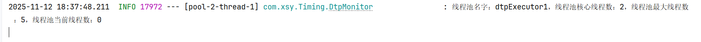
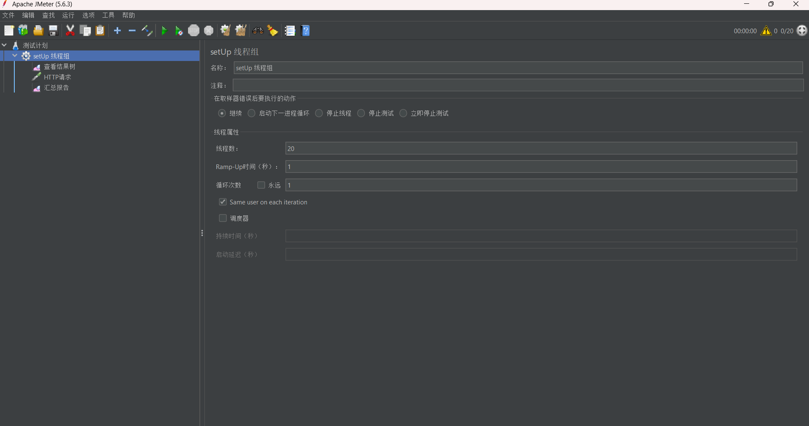
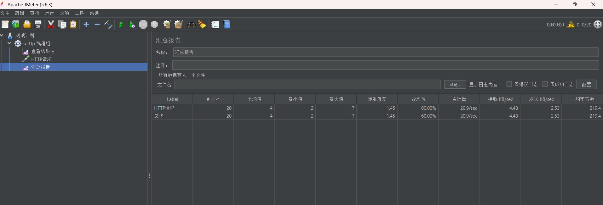
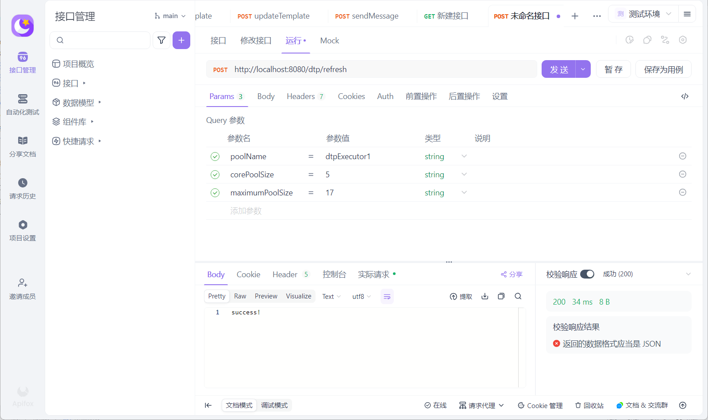
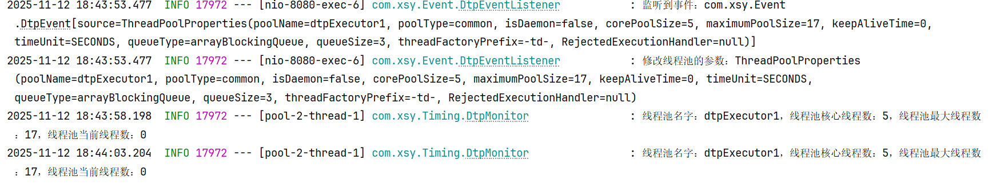
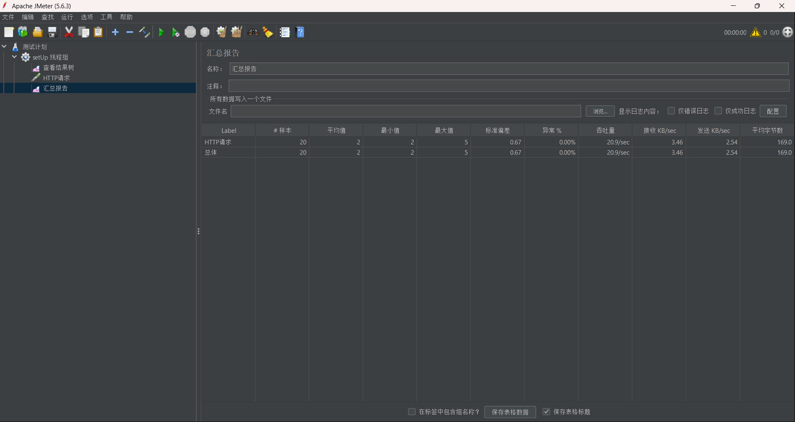

代码测试：
1.进行动态修改前测试
  结果：
    当前运行线程池的参数如下图（堵塞队列为3）：
    
    当前运行线程池的运行情况如下图：
    压测Jmeter工具参数，如图下所示，一共20个请求:
    
    压测结果，如图下所示，当20个请求成功率40%，说明当前线程池只有8任务执行:
    
2.进行动态修改后测试
  调用refresh接口进行线程池动态参数的实现
  
  修改后，线程池的参数如下图（堵塞队列为3不变）：
  
  压测Jmeter工具参数参数不变，运行结果如图下所示，一共20个请求，异常为0，说明动态参数修改成功:
  

